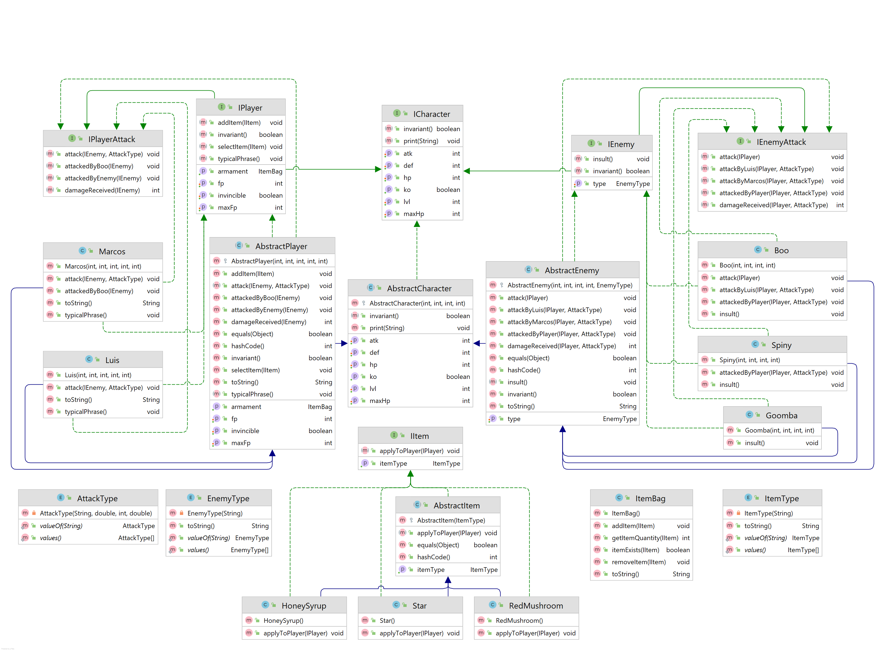
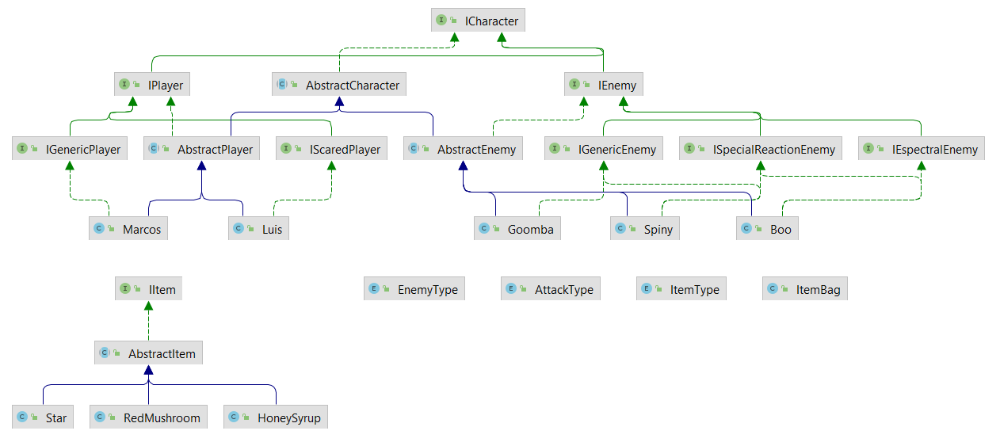
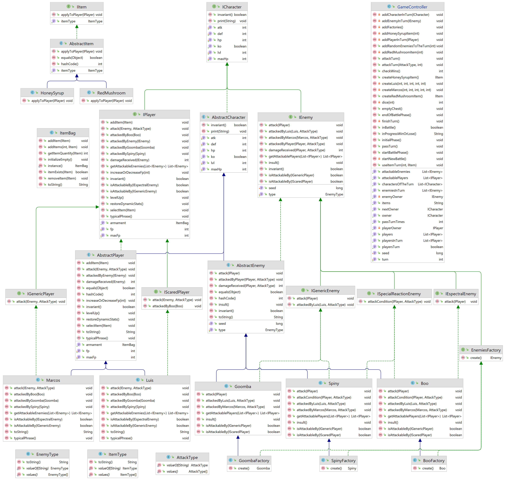
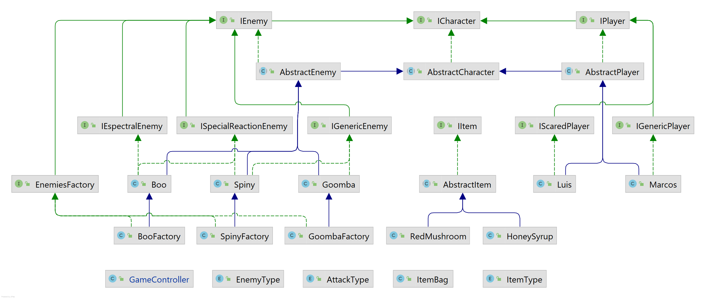
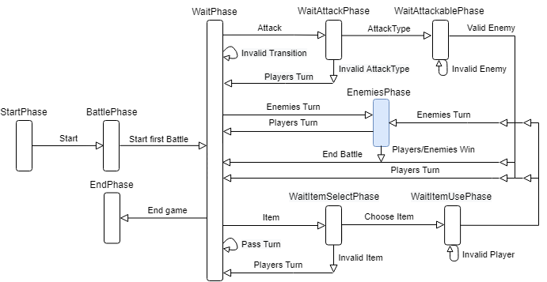
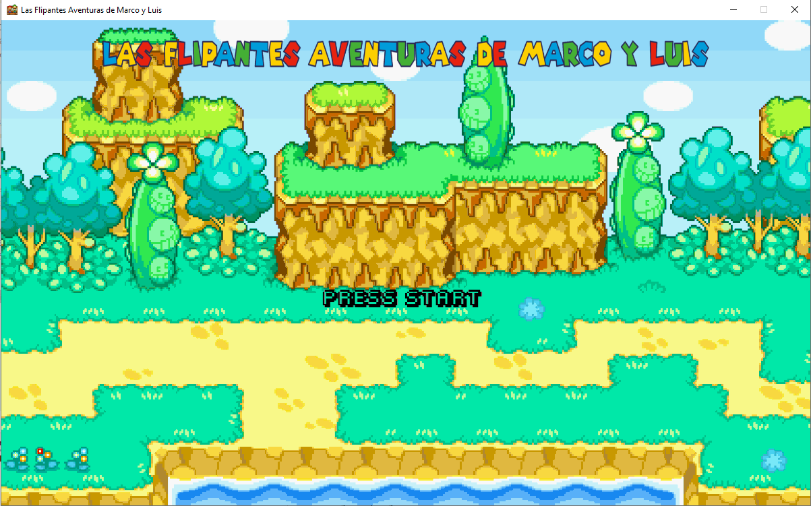
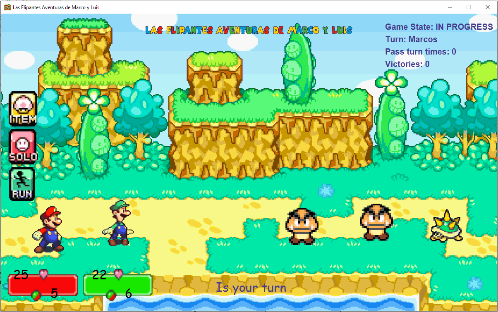
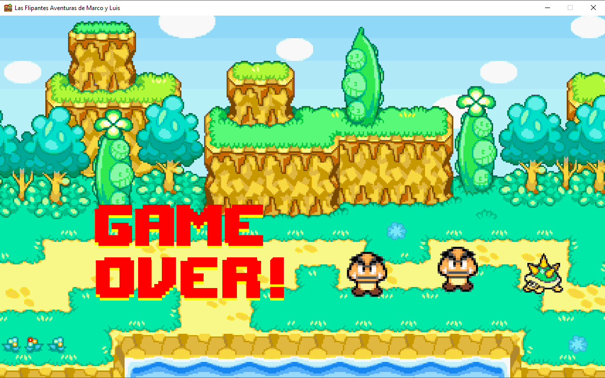
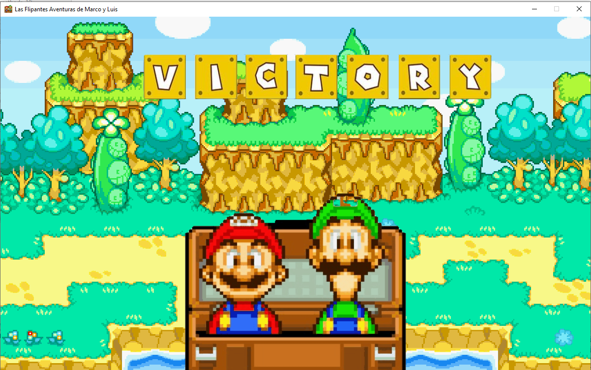
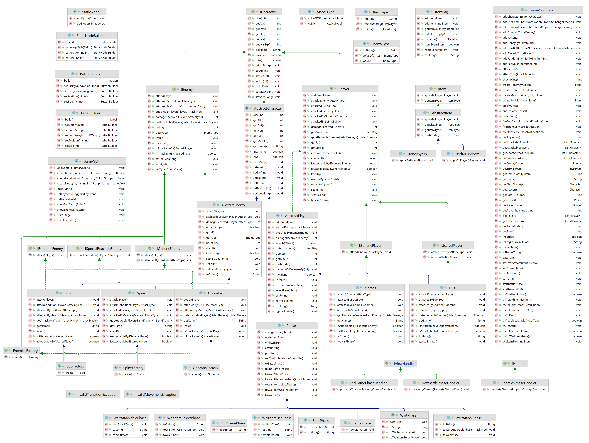

# Las Flipantes Aventuras de Marco y Luis
**Por: Sebastián Guzmán**

Primero que todo y antes de empezar... 

Si bien el nombre de 
esta historia suena prometedor, los verdaderos protagonistas
son **Marcos** y **Luis**. Ellos son dos hermanos que buscan
nuevas aventuras.

<div style="text-align: center;">
    <b>¡Y tú has sido elegido para ayudarlos en su búsqueda!</b>
</div>

## Personajes

Para que Marcos y Luis puedan aventurarse en el Reino Frijol,
país vecino del Reino Champiñón, ellos deberán enfrentarse a distintos
enemigos.

Por lo que le será útil saber cuáles serán las estadísticas de los
jugadores y enemigos en cuestión.

### Estadísticas
1. **Nivel (LVL)**: Corresponde al nivel del personaje, que permitirá 
subir el resto de estadísticas (como ATK, DEF, HP entre otros).
2. **Ataque (ATK)**: Corresponde al daño total que posee un personaje. A mayor ataque, mayor será el
   daño que se inflige.
3. **Defensa (DEF)**: Permite mitigar el daño recibido por un enemigo.
4. **Puntos de Vida (HP)**: Son los puntos de vida que posee un personaje. A mayor puntos de vida,
   pasará más tiempo en combate. Los puntos de vida NO pueden ser menores a 0.
5. **Puntos de Ataque (FP)**: Utilizados para realizar ataques. Solo lo poseen Marcos y Luis.

***Consideración 1: El HP inicial al comenzar el juego se contará como el HP máximo, igualmente este último 
podría aumentar al pasar los niveles. Misma lógica para los FP.***

### Tipos de ataques de los jugadores
Cada personaje principal, en su turno podrá ejecutar dos tipos de ataque:
- **Salto**:
  - Corresponde a un ataque normal, de bajo daño, pero que siempre lo recibe el enemigo.
  - Cuesta 1 FP
  - Su constante K para calcular el daño es 1
- **Martillo**:
  - Corresponde a un ataque avanzado, de mayor daño, pero que posee un 25 % de posibilidades de
  fallar
  - Cuesta 2 FP
  - Su constante K para calcular el daño es 1.5

### Cálculo del daño provocado
El daño realizado por un personaje atacante A hacia un personaje atacado B es
> Daño = K · (ATK personaje A) · (LVL personaje A) / (DEF personaje B)

_Donde:_
_K es la constante que entrega el ataque seleccionado.
La regla anterior aplica para todos los daños ocurridos entre enemigos y jugadores._

***Consideración 2: El daño siempre se calculará en función del entero más cercano.***

### Enemigos
Marcos y Luis enfrentarán a enemigos controlados por el computador, estos serán los siguientes:
- Goomba: Es un enemigo genérico. Solo atacarán de forma normal a Marcos y Luis cuando sea su
turno. Podrá ser dañado por cualquier tipo de ataque (Salto, Martillo).
- Spiny: Es un personaje con un caparazón con pinchos. Si un personaje principal ataca a Spiny con un
Salto, entonces el atacante recibirá un daño del 5 % de su HP, y Spiny no recibirá daño. Sin embargo,
Spiny podrá ser dañado por el resto de ataques (Martillo).
- Boo: Es un *fantasmita*. Ataca únicamente a Luis, y si recibe un ataque con martillo, lo esquiva. Puede
recibir el resto de ataques de forma normal (Salto).
Es importante notar que todos los enemigos tendrán un único tipo de ataque para usar contra los personajes
principales, en donde se aplicará la misma fórmula de ataque con K = 0,75.

### Tabla de ataques
La tabla de ataques será descrita a continuación:


|               | **Marcos**| **Luis**  | **Goomba** | **Spiny** | **Boo**  |
| :-------------|:---------:|:---------:|:----------:|:---------:|---------:|
| **Marcos**    |           |           | &#10004;   | &#10004;  | &#10004; |
| **Luis**      |           |           | &#10004;   | &#10004;  |          |
| **Goomba**    | &#10004;  | &#10004;  |            |           |          |
| **Spiny**     | &#10004;  | &#10004;  |            |           |          |
| **Boo**       |           | &#10004;  |            |           |          |

`Cuadro 1: Tabla de ataques. La forma de leer la tabla es: “Nombre de una fila” ataca a “Nombre de una
columna”. Por ejemplo, Marcos ataca a Boo, pero Boo no puede atacar a Marcos.`

***Consideración 3: Cuando un personaje intente atacar a otro sin que esté permitida su interacción,
simplemente no habrá gasto de recursos ni daño infligido.***

### Items
Los personajes principales tendrán la oportunidad de ocupar Objetos, conocidos popularmente como Items.
Los posibles items se resumen a continuación:
1. **Star:**
   - Hace que el personaje que la consuma entre al estado invencible.
2. **Red Mushroom:**
   - Cura al personaje una cantidad de 10 % del HP máximo del personaje.
3. **Honey Syrup:**
   - Restaura al personaje una cantidad de 3 FP.

***Consideración 4: Un personaje principal se dirá "invencible" si no percibe daño de ningún
ataque mientras el efecto este activo.***


## Requisitos aburridos de la Tarea 1
Lo que se pide para la Tarea 1 es:
```
- Crear los personajes principales y los enemigos con sus respectivas estadísticas.
- Crear los Items.
- Que los personajes principales sean capaces de ocupar Items.
- Contemplar las restricciones para los puntos de vida (esto es, que siempre estén entre 0 y HP máximo).
- Crear métodos para utilizar los datos de cada personaje y considerar la privacidad en su código.
- Añadir un método para saber si el personaje está derrotado.
- Si un personaje está K.O. entonces no podrá atacar (siempre ataca con 0 de daño).
```

#### Paso 1: Hacer los primeros tests para jugadores y enemigos.
***Consideración 5: Se crean frases típicas e insultos para jugadores y enemigos, respectivamente,
para darle emoción a los tests.***

_De momento se espera tener una clase **Personaje** que contenga a la clase de **Jugadores** y de **Enemigos**, todas 
abstractas, con el fin de reutilizar funcionalidad común y dar orden y jerarquía al código._
1. Se prueban (en un test de jugadores) los constructores que darán vida a Marcos y Luis (a cada uno le corresponderá 
una clase).
   1. Se imprimen sus "frases típicas" para revisar si ya existen.
   2. Se verifica que no son iguales entre ellos, ni tampoco a un enemigo. 
2. Se prueban sus getters y setters.
   - ***Estos serán usados por muchos tests para hacer pruebas por lo que se necesita que sean públicos 😢.***
   - Las variables de forma interna serán `protected` ó `private`.
   1. Se verifica que la noción de estar K.O. se cumple cuando el personaje está en 0 HP.
   2. Se verifican las restricciones de vida HP y puntos de ataque FP (como la vida se implementa para todos los personajes,
   en principio bastaría probar **1.** y **2.** solo con un jugador arbitrario). 
3. En otro test para enemigos se crean Goomba, Spiny y Boo (a cada uno le corresponderá una clase).
   1. Se imprimen sus "insultos" para revisar si ya existen.
   2. Se prueban sus getters y setters, cada enemigo tendrá su "tipo" que le identifica y guarda su información.
#### Paso 2: Hacer los tests para que jugadores puedan usar items.
***Consideración 6: Dos jugadores son iguales si tienen la misma clase (Ej.: Marcos) y sus estadísticas son las mismas,
pero no dependen de los items que posean. Lo mismo para los enemigos, pero contando también su "tipo".***
1. Se prueban los constructores de los items (todos los items extenderán a la misma clase de items).
2. Se verifica que no son iguales entre si.
3. Se agregan los items al inventario y se seleccionan para testear su funcionalidad (La noción de inventario sugiere 
una nueva clase 
**Bolsa de Items** en la cual ir llevando el conteo).

#### Paso 3: Tests de ataques entre jugadores y enemigos.
1. Se verifican las estadísticas propias de cada ataque (Lo que sugiere una clase **Tipo de ataque** que al menos 
permita guardar la constante de ataque K, la probabilidad de fallar y el costo de puntos de ataque).
2. Se realiza el ataque de Marcos y Luis a Goomba.
   1. Se verifican condiciones "normales" y se agrega un tope alto del FP máximo a los jugadores para saber si gastan 
   correctamente sus puntos de ataque.
   2. Luego se testea el ataque de tipo Martillo, como este tiene probabilidad de fallar, se implementa mediante un 
ciclo `while()` que rescatará la proporción de ataques conectados y fallados, revisando finalmente si su FP se gastó
   correctamente.
   3. Igual que antes, se testea el Salto, a pesar de tener nula probabilidad de fallar, todos los ataques implementarán
   el ataque de manera probabilística, para que el proceso que haga los cálculos sea generalizable a nuevos ataques con
   probabilidad "p" arbitraria de fallar (y también se verifica el correcto gasto de fp).
   4. Luego se repite el experimento con 0 puntos de ataque (pero estando "no K.O.").
   5. Finalmente se repite el experimento estando K.O. pero con puntos de ataque disponibles, para ver que ataca con 
   daño 0.
3. Se realiza el ataque de Marcos y Luis a Spiny.
   1. Igual que antes se verifican las c.i. y se usan ciclos `while()` para medir con probabilidad.
   2. Una salvedad en este caso, es verificar que Spiny hace daño cuando es atacado con Salto, el jugador gasta su FP y
   Spiny no recibe daño.
   3. Igual que en el caso anterior se prueban los ataques para K.O. con FP y sin F.P pero no K.O.
4. Marcos ataca a Boo.
   1. Se verifican las c.i.
   2. Al igual que antes se hacen ciclos para probar ante probabilidad los ataques.
   3. Se debe considerar ahora el caso en que Boo es atacado con Martillo, ya que aquí Boo no recibe daño, pero sus FP
   igualmente deben ser consumidos, ya que hizo el ataque.
   4. Igual que en el caso anterior se prueban los ataques para K.O. con FP y sin F.P pero no K.O.
5. Luis ataca a Boo.
   1. Este caso es fácil de verificar, solo hace falta revisar que Luis no haga daño alguno a Boo, con ningún ataque.
6. Goomba y Spiny atacan a Marcos y Luis.
   1. Ahora debemos verificar que si el jugador está invencible los enemigos no generen daño.
   2. También se debe testear que si el enemigo esta K.O. ataque con daño 0.
7. Boo ataca a Marcos.
   1. Este caso también es sencillo de verificar, solo basta ver que Boo (estando "no K.O.") no haga daño a Marcos.
8. Boo ataca a Luis.
   1. Nuevamente se debe verificar que el jugador no reciba daño si está invencible.
   2. Finalmente se debe testear que el enemigo ataque con daño 0 cuando esta K.O.

#### Paso 4: Diseñar las interfaces y Enums.
1. Se crean las interfaces de los métodos necesarios que podrán ejecutar **Personajes**, **Jugadores** y 
**Enemigos**.
   1. En la primera estarán todos los getters y setters comunes, un print para ver el texto y el invariante (abstracto).
   2. En la segunda los getters y setters del FP, los de verificación de invencibilidad y funcionalidad para operar los
   items del inventario (**la clase "Bolsa de Items" no tendrá interface, ya que trabaja bien "sin interactuar" fuera del 
   jugador**), como añadir, seleccionar y obtener el armamento (para visibilidad), la frase típica y
   el invariante (ahora de HP y FP).
   3. En la tercera estará el getter y setter para el **tipo de enemigo** (tipos creados en una clase enum), su insulto y el invariante (en este caso solo
   de HP).
2. Se crea la interfaz para los **Items**, que permitirá fungir el item en cuestión y obtener el **tipo de item** (tipos creados en
una clase enum, pero además tendrán sus clases propias).
3. Interfaces para Double Dispatch que deberán implementar las clases del jugador y el enemigo.
   1. Se crea el interface **Ataque del Jugador** y **Ataque del Enemigo**.
   2. Cada una se encargará de un método de ataque al contrincante y métodos que avisan al personaje atacado
   quien precisamente los está atacando (Ej.:Jugador implementa **Atacado por Boo**, Enemigo
   implementa **Atacado por Luis**).
   
#### Paso 5: Paso TRIVIAL (¡Programar 🤓!).
1. Básicamente llevar a cabo la implementación de los métodos descritos en las interfaces verificando que se cumplan los tests.
2. Agregar además los métodos `Equals()`, `hashCode()` y `toString()` en las clases que requieran testeo de duplicidad y
constructores mencionados en el apartado de testeo.
3. Programar la **Bolsa de items** con un enum map sobre el enum de los **tipos de item**. para asegurarnos de siempre 
tener en cuenta todos los items que el jugador podría llegar a obtener.

***Consideración 7: Probablemente el double dispatch no está bien implementado, ya que se hizo uso de 
un if para los casos de tipos de ataque que no deben funcionar como lo hacen de costumbre, como Spiny con Salto
y Boo con martillo, por lo que si es necesario, se espera modificar el enum de **tipos de ataque** por una clase normal.***

***Consideración 8: El cálculo de probabilidades se hizo obteniendo un número aleatorio en [0,1] y verificando si era o
no mayor a la probabilidad "p" de fallar. Los lectores podrán dar cuenta que esto entrega `True` con probabilidad "1-p" y 
`False` con probabilidad "p". Lo que puede ser utilizado para dar el veredicto de sí atacar o no.***

### Paso 6: Documentar (Javadoc).
Se documentan todas las clases, interfaces y métodos públicos con la metodología "Java de Google" para los Javadocs.

### Paso 7: Coverage.

Buscar el coverage del 100% EN TODOS LOS CAMPOS (si, en TODOS).

### Paso 7: Resumen.

Hacer este breve resumen (si, breve...).

### Paso 7: Diagrama UML.


`Figura 1: Diagrama UML del juego para la Tarea 1.`

## Consideraciones Adicionales

Para ejecutar el código, clone este repositorio y corra `Run 'All Tests'` (Si está trabajando desde IntelliJ IDEA) sobre src/test/java o corra los test como le sea conveniente según su entorno preferido de desarrollo. 


## Tarea 2: Entrega parcial 1 

Para esta breve entrega, se modificó el ataque realizado por los personajes, con el fin de mejorar el diseño propuesto
la primera entrega. Para esto, se implementaron distintas interfaces que ayudaron a comprender mejor el rol que cumple
cada personaje en el juego de acuerdo a la tabla de ataques anteriormente mencionada.

##### Interfaces

**1.-IGenericPlayer: Un jugador se dirá genérico, si ataca a todos los enemigos.**

**2.-IScaredPlayer: Un jugador se dirá asustado, si no ataca a los enemigos espectrales.**

**3.-ISpectralEnemy: Un enemigo se dirá espectral, si ataca solo a los jugadores asustados.**

**4.-IGenericEnemy: Un enemigo se dirá genérico, si ataca a todos los jugadores.**

**5.-ISpecialReactionEnemy: Un enemigo se dirá de reacción especial, si al ser atacado puede actuar o ser atacado de forma distinta
al ataque por fórmula convencional de ataque.**

Una vez dicho esto, se implementan las interfaces, donde Marcos será un jugador genérico, Luis será un jugador asustado,
Spiny y Goomba serán enemigos genéricos, pero además, Spiny será un enemigo de reacción especial al igual que Boo.

Con esto en mente, cada interfaz implementó el método de ataque hacia el personaje que puede atacar, y se le agregaron los 
ataques recibidos por cada uno de los personajes que efectivamente pueden atacarle.

A continuación se presenta el nuevo diagrama de clases que resumen la estructura del juego por el momento, y que recibirá
actualizaciones en el corto plazo.



`Figura 2: Resumen de clases para la entrega parcial 1 de la Tarea 2.`

Respecto al resto de modificaciones, se borraron los test correspondientes a enemigos y jugadores que no podían atacar al
contrincante, ahora simplemente saldrá un error en pantalla si se intenta ejecutar un ataque no válido. Igualmente toda la 
funcionalidad sigue testeada, ya que solo cambió el diseño y no el propósito. Además de esto, se reconectaron de mejor forma
las interfaces para que el diagrama de clases tenga una intención más clara.


## Tarea 2:

Esta tarea consiste en implementar la base del controlador del juego. El controlador
servirá como intermediario entre los objetos del modelo y la interfaz gráfica de la aplicación.
Este debe encargarse de mantener todos los parámetros necesarios para implementar las
reglas y el flujo del juego. El controlador pueden ser una o más clases, pero es importante que la
interfaz gráfica no interactúe directamente con los objetos del modelo y viceversa.

El objetivo de la creación del controlador será enviar mensajes a los objetos del modelo indicándoles lo que deben
de hacer y los objetos del modelo deben de ser capaces de comunicar al controlador sobre cualquier
cambio que sea relevante para el flujo del juego y para el usuario.

Para llevar a cabo su implementación será necesario introducir algunos conceptos que se presentan a continuación:

###  Baúl

Los personajes principales tendrán un baúl compartido en donde almacenaran los Items que se dan en el
juego, en el caso de la estrella, esta se sacó del juego para quitar algo de complejidad al testeo posterior 
del controlador. Cuando un personaje principal quiera utilizar un elemento lo debe retirar
del baúl y este dejará de existir en el compartimiento.

### Batalla

La parte principal de este juego serán las Batallas, que corresponde a un encuentro entre los personajes
principales y los enemigos. Modelaremos una batalla a través de un sistema de turnos, donde ignoraremos
la presencia de velocidad.

### Avance de nivel

Cuando los jugadores ganan una batalla aumentan su nivel en 1 y sus estadísticas aumentan en 15 % con
respecto al valor actual (en el caso de HP Y FP, aumentan en el 15 % de su máximo). Por ejemplo, si ATK
era 20, entonces esta estadística aumenta en 3. De la misma forma, si el HP era 5, pero el HP máximo era
20, el HP máximo aumenta en 3 también.

### Turnos.

El orden en que los personajes tomarán turnos será el siguiente: Marcos, Luis, y el resto de enemigos (en un orden
predefinido y fijo para el resto de la batalla). Luego de que algún personaje termine su turno, avanzará el turno
del siguiente personaje, y así hasta que acabe la batalla. Si algún personaje queda K.O. durante el desarrollo de
la batalla queda inhabilitado para usar su turno, se quita de la lista y continua el personaje siguiente.

#### Turno para los Personajes Principales

**Turno de Ataque:** En un turno de ataque se realizan las siguientes acciones:
- Seleccionar algún tipo de ataque (Salto o Martillo).
- Seleccionar un enemigo para ejecutar el ataque, gastando FP según sea el tipo de ataque.
- Fin del turno.

***Consideración 8: Si no se cumple con las restricciones de FP para ejecutar el ataque o el enemigo no es válido, el
turno no termina. Se mantiene el turno hasta que se haga un movimiento válido.***

**Turno para Ocupar un Item:** En el turno para utilizar un Item los pasos son los siguientes:
- Escoger un Item de los disponibles en el baúl de objetos.
- Seleccionar el personaje principal sobre el cual tendrá efecto el Item.
- Fin del turno.
- 
***Consideración 9: El item podrá ser seleccionado por el jugador del turno actual y solo podrá usarse sobre los jugadores
que sigan en pie, es decir, que no estén K.O., si no es un item válido o no se cumple lo anterior, el turno no terminará 
de la misma forma que para el turno de ataque.***

**Turno para Pasar:** Al escoger la opción de pasar simplemente se avanza al siguiente turno.

***Consideración 10: Los jugadores en total pueden realizar 5 turnos para pasar, si se realizan más, el juego 
acaba en la derrota de los jugadores.***

#### Turno para los Enemigos

**Turno para atacar:** Dado que los enemigos no poseen FP, ni tampoco poseen tipos de ataque o Items, la única opción que tiene
es atacar a algún personaje principal, en donde se seguirán los siguientes pasos:
- Escoger aleatoriamente algún personaje principal que no esté K.O. en la batalla siguiendo las restricciones de ataque para enemigos.
- Realizar ataque correspondiente.
- Fin del turno.

***Consideración 11: Si el enemigo en turno no puede atacar a ningún personaje, simplemente pasa su turno.***

### Fin de la batalla
Una batalla finaliza si alguno de los siguientes casos ocurre:
1. Cuando todos los enemigos queden K.O., o bien,
2. Cuando todos los personajes principales queden K.O. o pasan más de 5 veces en una batalla.

En el primer caso los personajes principales ganan y acá se presentan dos casos:
- Si es su 5ta victoria, ganan el juego y termina la partida.
- Si aún no completan 5 victorias, aumenta su nivel en 1 aumentando con ello sus estadísticas.

### Partida
La partida se refiere desde el inicio del juego hasta su final. A continuación se describen las etapas de la
partida:

- **Etapa Inicial:** Se regalan 3 Red Mushroom y 3 Honey Syrup que se almacenan en el baúl de los personajes
principales.
- **Inicio Batalla:** Se reinicia la vida de los jugadores y sus FP y se organizan los turnos como se describe
en la sección de **Turnos** para dar inicio a la batalla.
- **Fin Batalla:** Si los personajes principales pierden la partida se termina el juego. Si Marcos y Luis ganan
la batalla, se agrega 1 Red Mushroom y 1 Honey Syrup al baúl, se actualizan sus estadísticas (HP, ATK,
etc.) de acorde con lo descrito en la sección de **Avance de nivel** y se prepara la siguiente batalla como se describió
anteriormente, a menos que sea su 5.ª victoria, en ese caso ganan el juego.

El avance de los personajes principales a medida que ganan batallas implicará otros cambios que se
especifican en la siguiente tabla: 

|Nivel|                Baúl                | Enemigos en batalla |     HP    | ATK  |     FP    | DEF  |
| :---|:----------------------------------:|:-------------------:|:---------:|:----:|:---------:|-----:|
|  1  |+ 3 Red Mushroom<br/> +3 Honey Syrup|     3 aleatorios    |    +0     | +0   |    +0     |  +0  |
|  2  |+ 1 Red Mushroom<br/> +1 Honey Syrup|     3 aleatorios    |+15% HP max| +15% |+15% FP max| +15% |
|  3  |+ 1 Red Mushroom<br/> +1 Honey Syrup|     5 aleatorios    |+15% HP max| +15% |+15% FP max| +15% |
|  4  |+ 1 Red Mushroom<br/> +1 Honey Syrup|     5 aleatorios    |+15% HP max| +15% |+15% FP max| +15% |
|  5  |+ 1 Red Mushroom<br/> +1 Honey Syrup|     6 aleatorios    |+15% HP max| +15% |+15% FP max| +15% |

`Cuadro 2: Tabla de progreso para jugadores por nivel y enemigos para cada batalla.`

## Requisitos aburridos de la Tarea 2
Lo que se pide para la Tarea 2 es:
```
- Implementar los ataques entre personajes y enemigos siguiendo las reglas previas y buenas prácticas
de diseño.
- Cuando un personaje principal aumenta de nivel, actualizar sus estadísticas como se comenta en la
sección de "Avance de nivel".
- Implementar el baúl de Items.
- Que se pueda añadir elementos al baúl
Crear el controlador del juego, con el cual:
• Crear a los personajes principales.
• Crear a los enemigos.
• Crear a los Items.
• Crear el baúl de los personajes principales.
• Implementar los turnos.
• Que un jugador pueda utilizar un elemento al baúl.
• Obtener los elementos del baúl.
• Obtener todos los personajes del turno.
• Quitar a un personaje del “turno” cuando está K.O.
• Saber cuando los personajes principales ganan o pierden.
• Obtener el personaje que posee el turno actual.
• Obtener el personaje del siguiente turno.
• Terminar el turno del jugador actual.
• Ejecutar una batalla.
```

#### Paso 1: Modificación a la clase ItemBag para implementar el baúl.

Para la tarea 1 se tenía una especie de armamento para cada personaje implementado mediante la clase ItemBag, 
ahora se pide que el armamento sea un baúl compartido, para lo cual se dispone del _Singleton Pattern_, el cual
permitirá a todos los jugadores y al controlador, poseer instancias del mismo objeto baúl, que será único para todo el juego y
que ya posee todos los métodos que interesan a la hora de manipular el baúl en el controlador.

#### Paso 2: Creación de métodos de para el aumento de nivel.

Se crea el método ```levelUp()``` en la clase AbstractPlayer bajo las condiciones anteriormente mencionadas para el avance de nivel.

#### Paso 3: Factory Pattern para enemigos.

Se implementa el Factory pattern como una forma de ordenar la creación posterior de enemigos aleatorios por parte del controlador.
Esto no se realiza para los items o los jugadores, ya que los jugadores se crean solo al comienzo del juego y dado que el juego se llama
"Las flipantes aventuras de Marco y Luis", no parece ser necesario de momento, crear demasiados jugadores. Por parte de los items, 
son solamente dos luego de quitar el item _Star_, por lo que de momento no se implementa una fábrica para los items.

#### Paso 4: Turnos de enemigos y jugadores.

Esta es una de las partes más directas, ya que el modelo ya sabe comportarse a casi todas las situaciones descritas por los turnos.
Ahora solo se debe llamar a cada método con una restricción que verifique que el movimiento sea válido antes de terminar el turno.

#### Paso 5: Implementar lógica de turnos.

Este es posiblemente el paso más abierto/creativo, ya que existen muchas formas de implementarlo. Viendo el contexto previo de clases,
es posible dar cuenta que en la Tarea 1, se tenía una jerarquía muy restrictiva para los jugadores y enemigos en el ámbito del ataque, 
dadas las interfaces que recibían los métodos de ataque, por lo que se intentó relajar al menos en las firmas de los métodos ```attack(...)```, 
sin dejar en ningún momento de cumplir las restricciones del juego. Por lo que al implementar los turnos, se implementaron principalmente dos listas,
una para jugadores en turno y otra para enemigos en turno, donde se almacenan los jugadores y enemigos que aún siguen en batalla.

Para saber el dueño del turno actual y posterior, se trabajó con las listas como si fueran colas, por lo que al momento de finalizar el turno, 
el jugador o enemigo se pone a la cola en su lista respectiva, antes verificando que el personaje no murió en el inter-tanto. Dada
esta configuración, al elegir un personaje de cualquiera de las listas, no se presentan problemas de firmas con los métodos de las clases
que implementan los ataques (evitando el temido CASTING). Para que esto funcione correctamente y no se abuse de la relajación de la firma,
antes de ejecutar el ataque, se entrega una lista de los enemigos que el jugador puede atacar y para enemigos, una lista de 
jugadores que puede atacar, así el personaje nunca podrá "pasarse de listo".

Como última observación, para entregar estas listas de posibles contrincantes atacables, se implementó un método ```getAttackable{Enemies/Players}()``` 
que se puede decir "complejo", ya que requería cada personaje de una lista de posibles "atacables" supiera el interface de ataque del 
personaje que quiere atacarlos, lo cual no podía implementarse en la clase más genérica de personajes de forma común para todos, y que esta clase
aplicara el "this" sobre la clase más particular. De hecho el método no funciona si se implementa directamente en la clase personajes,
por lo que se repitió este método de forma idéntica en cada jugador y enemigo específico, ya que el "this", de cada método es distinto
y el método cambia completamente su funcionalidad gracias a esto.

#### Paso 6: Variables relevantes en el flujo del juego.

Para saber si se está en la cola de jugadores o en la de enemigos, es posible guardar el estado, es decir, en todo momento saber si están jugando
los jugadores o los enemigos, así también, resulta interesante saber si se está en batalla o si la partida esta en progreso, o los jugadores 
ya ganaron o perdieron, estas son algunas de las variables importantes, pero para mayores sutilezas como ver getters y setters, es mejor entrar a mirar el código.

#### Paso 7: Fases que determinan el flujo del juego.

Se crea la ```initialPhase()``` en el controlador, donde se agregan los jugadores al juego mismo y se dan los primeros items,
luego se crea la fase ```startBattlePhase()``` que permite restaurar la vida de los jugadores al empezar cada batalla y los agrega
a su lista de turnos, además de agregar los enemigos aleatorios necesarios para cada batalla a la lista de enemigos en turno. Finalmente
se hacen cambios en variables relevantes para el flujo del juego y se fija el primer turno.

Una vez hecho esto, ya se tiene conocimiento del dueño del turno y este puede ejecutar su turno sin presencia de velocidad, es decir, 
no tiene un tiempo para tomar su decisión. Una vez que se cumplen las condiciones para terminar una batalla se ejecuta el método 
```endOfBattle()``` que permite tomar la decisión de seguir con el juego o acabar con una victoria o derrota. Si el juego continúa, una
nueva fase ```startNewBattle()``` es llamada de forma automática limpiando las listas de turnos, agregando los items correspondientes, 
subiendo el nivel de los jugadores y llamando nuevamente a ```startBattlePhase()```.

#### Paso 7: Documentar y Testear.

Como el testeo se vuelve complejo ante la aleatoriedad y el uso de semillas, sumado a la dificultad de revisar listas de posibles
enemigos y jugadores atacables, resulta más sencillo en este caso testear una vez implementado el controlador, ya que el flujo se hace
mucho más fácil de verificar si se logra obtener las variables que determinan el flujo del juego como una guía para testear la batalla.

Se intenta testear todas las posibles situaciones incluyendo posibles decisiones inválidas o casos bordes, buscando cubrir todos los 
métodos implementados, que fueron también debidamente documentados, incluso estando privados para una mejor comprensión tanto al programador, 
como al cliente.

#### Paso 8: Diagramas UML terminada la Tarea 2.

A continuación se muestra el diagrama de clases del modelo completo y un resumen de la clases para tener una idea más general
de la programación del juego hasta el momento.



`Figura 3: Diagrama UML completo para la tarea 2.`



`Figura 4: Diagrama de Clases que resume las interacciones de las clases del juego.`

## Tarea 3:

Para dar término a la creación de nuestro juego, esta última tarea consiste en implementar el *flujo del juego*.
Basándonos principalmente en los requisitos de las secciones de batalla, partida y fin de juego. De aquí se definirán 
todas las fases y las transiciones entre ellas (considerando las condiciones que deben cumplirse) para pasar de una a otra.
Para el caso especial de interacción del usuario se crearon fases adicionales que representen una *fase de espera*.

Así creó un diagrama de flujo tipo, para llevar a cabo las fases del juego mediante el State Pattern.



`Figura 5: Diagrama de flujo tentativo, "Enemies Phase" es una fase virtual de paso instantáneo.`


Una vez hecho este diagrama, fue bastante sencillo realizar las fases, realizando por medio de un observador la acción
automática por parte de los enemigos de atacar. Al recibir una notificación de comienzo de la fase de enemigos.

Una vez hecho esto, se incorporó al test del controlador el uso de las fases respectivas para probar su correcto funcionamiento.

Luego de esto se procedió a crear una interfaz gráfica para la aplicación con menú de inicio de juego básico y un entorno
interactivo con las características mínimas para funcionar más un formato lo suficientemente atractivo para querer jugar.

### Las Flipantes Aventuras de Marco y Luis (Versión final)


`Figura 6: Interfaz del menú de inicio de la aplicación.`


`Figura 7: Interfaz de batalla del juego.`


`Figura 8: Interfaz de derrota del juego.`


`Figura 9: Interfaz de victoria del juego.`

### Resumen de las reglas del juego:

- Al iniciar la aplicación, para empezar el juego, se debe dar clic en **Press Start**, botón visible en la figura 6.
- A continuación se abrirá la interfaz de batalla de la figura 7:
  - En pantalla se muestran los jugadores y sus estadísticas.
  - Los enemigos de la batalla actual.
  - Una instrucción en la parte inferior para guiar el flujo del juego.
  - Estadísticas del juego en la esquina superior derecha.
  - Tres botones que permiten realizar un turno válido por parte de los jugadores.
- En esta ventana el jugador puede, pasar con el botón **RUN**, Atacar con el botón **SOLO** o usar item con el botón **ITEM**.
- Al hacer uso de **RUN**, el jugador cede el turno y se cuenta 1 turno pasado a la cuenta, al pasar los 5 turnos cedidos los jugadores pierden.
- Al hacer uso de **SOLO**, el jugador puede seleccionar **SALTO** o **MARTILLO**, con las teclas **1** y **2** respectivamente. Luego selecciona al enemigo y se ejecutará el ataque.
- Al hacer uso de **ITEM**, el jugador puede seleccionar **RED MUSHROOM** o **HONEY SYRUP** dando clic al icono respectivo cuando este aparezca en el baúl.
- Una vez seleccionado el item, puede seleccionar a algún aliado para que use el objeto.
- Tanto las interfaces de **SOLO** como de **ITEM** son retroactivas para sí mismas como entre ellas (se puede arrepentir), y el **RUN** también las desactiva. Volviendo en cualquier caso a la fase de espera inicial.
- La batalla se pierde además de por los turnos cedidos, porque mueren ambos jugadores (figura 8), se gana cuando se alcanzan 5 victorias derrotando a todos los enemigos por ronda, bajo todas las restricciones previamente mencionadas (figura 9).

### Diagrama UML


`Figura 10: Diagrama UML final de la aplicación.`

_Tarea del curso CC3002-1: Metodologías de Diseño y Programación - Primavera 2021._